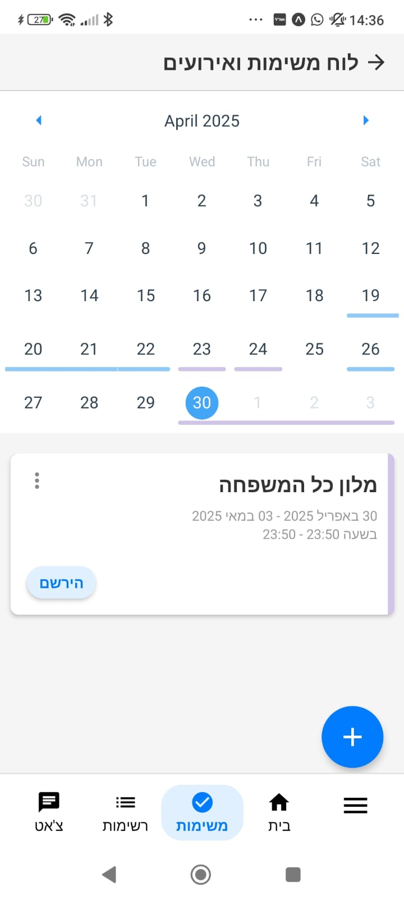
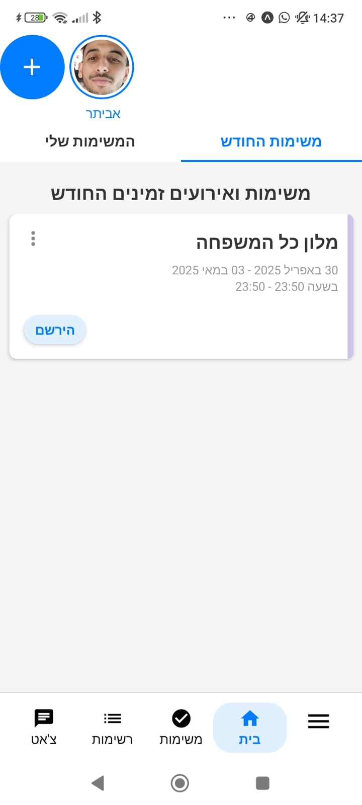
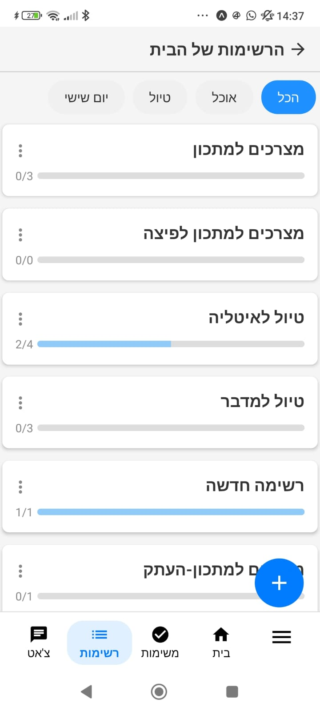

# 🧹 CHORES – A Home Task Management App

**CHORES** is a React Native application designed to help families and housemates manage their daily home tasks efficiently. With features like task tracking, calendar events, lists, chat, personal area, and daily stories – CHORES keeps your home organized and connected.

## 🚀 Key Features

- ✅ **Task Management** – Create, update, and track home chores.
- 📅 **Event Calendar** – Add and view family/home events in a calendar format.
- 📝 **Custom Lists** – Shopping lists, to-do lists, and more.
- 💬 **Real-Time Chat** – In-app messaging using Firebase.
- 📸 **Stories** – Share daily images or updates with the household.
- 👤 **Personal Area** – Manage user profile and preferences.
- 🛡 **Authentication & Authorization** – Secure login with JWT Tokens.
- 🗃 **Entity Framework Core** – For efficient and scalable backend data management.

## 🛠 Tech Stack

- **React Native (with Expo)**
- **Firebase (Realtime Database & Storage)**
- **.NET Core + Entity Framework Core**
- **JWT (JSON Web Tokens)**

# 📷 Screenshots

### 🧾 Tasks & Events in Calendar

<p align="center">
  
</p>

---

### 🏠 Home Screen

<p align="center">
  
  
</p>

---

### 📋 Lists Screen

<p align="center">
  
</p>

---
## 🏁 Getting Started

To run the app locally:

```bash
git clone https://github.com/Evyatarmk/Chores.git
cd Chores
npm install
npx expo start --tunnel
